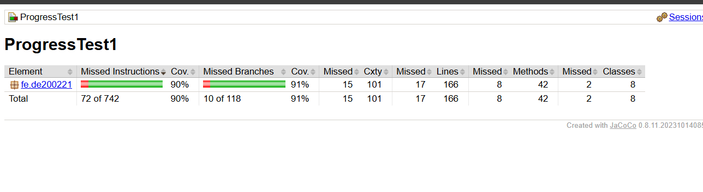

# SWT301 – ProgressTest 1: Unit Testing với JUnit 5
**Module:** Account Management  
**Học viên / MSSV:** DE200221  

---

## 1. Hướng dẫn chạy và sinh báo cáo kiểm thử

Sử dụng Maven để biên dịch, chạy toàn bộ test và tự động sinh báo cáo JaCoCo:

```bash
# Chạy toàn bộ test suite và sinh báo cáo JaCoCo coverage
mvn clean test

# Báo cáo JaCoCo HTML xem tại:
target/site/jacoco/index.html
```

---

## 2. Kết quả kiểm thử & Độ bao phủ (JaCoCo Coverage)

### 2.1. Kết quả thực thi test
- **Tổng số phương thức test:** 29 phương thức core (vượt yêu cầu $\ge 20$)
- **Số `@ParameterizedTest`:** 18 bài (vượt yêu cầu $\ge 12$)
- **Tổng lượt chạy (invocations):** **164/164 PASSED** (0 failures, 0 errors, 0 skipped) (vượt yêu cầu $\ge 60$)
- **Đầy đủ nguồn dữ liệu:** `@ValueSource`, `@NullAndEmptySource`, `@CsvSource`, `@MethodSource`.

### 2.2. Chỉ số bao phủ mã nguồn (JaCoCo)
- **Line Coverage:** **90%** (149/166 lines covered - Yêu cầu đề bài $\ge 80\%$)
- **Branch Coverage:** **91%** (108/118 branches covered - Yêu cầu đề bài $\ge 70\%$)
- *Ảnh chụp báo cáo coverage:* `docs/images/jacoco-coverage.png`



---

## 3. Bảng kiểm thử đột biến thủ công (Manual Mutation Testing)

Đã thực nghiệm cấy 6 lỗi đột biến vào mã nguồn, cả 6/6 lỗi đều bị bắt và làm fail bài test tương ứng:

| # | Vị trí / Lỗi chèn | Thay đổi mã nguồn | Test phát hiện (bị fail) | Đã hoàn tác |
|---|---|---|---|:---:|
| **M1** | `AccountService.login()` | `>= MAX_FAILED_ATTEMPTS` $\to$ `> MAX_FAILED_ATTEMPTS` | `Login.login_WrongPassword5thTime_LocksAccount`, `Login.login_WhileLocked_RejectsWithoutIncrement` | ✅ |
| **M2** | `AccountService.login()` | Bỏ nhánh `if (acc.isLocked())` | `Login.login_WhileLocked_RejectsWithoutIncrement`, `Login.login_CorrectPasswordAfterNFailures[5]` | ✅ |
| **M3** | `AccountService.login()` | Bỏ gọi `acc.resetFailedAttempts()` khi login thành công | `Login.login_SuccessAfterFailures_ResetsCounter` | ✅ |
| **M4** | `AccountValidator` | Regex username: `{4,19}` $\to$ `{4,20}` | `AccountValidatorTest$Username.isValidUsername_BoundaryLength[21]` | ✅ |
| **M5** | `AccountService.register()` | Kiểm tra tuổi: `< MIN_AGE` $\to$ `<= MIN_AGE` | `Register.register_AgeBoundary[18, 0]` | ✅ |
| **M6** | `Account.unlock()` | Quên đặt `failedAttempts = 0` | `Login.login_AfterAdminUnlock_CounterRestartsAndCanLogin` | ✅ |

---

## 4. Ma trận truy vết nghiệp vụ (Business Rules Traceability Matrix)

| Business Rule | Nội dung quy tắc | Phương thức Test bảo vệ |
|---|---|---|
| **BR-REG-01** | Bắt buộc nhập username, email, password, confirm, DOB, không ở tương lai | `Register.register_UsernameNullEmptyBlank_*`, `register_EmailNullEmptyBlank_*`, `register_PasswordNullEmptyBlank_*`, `register_InvalidInput_ReturnsExpectedCode[dob null]`, `register_AgeBoundary[0, 1]` |
| **BR-REG-02** | Username 5–20 ký tự, bắt đầu bằng chữ cái, [A-Za-z0-9_] | `AccountValidatorTest$Username.*`, `register_InvalidInput_ReturnsExpectedCode[username sai]` |
| **BR-REG-03** | Không trùng username (không phân biệt hoa/thường) | `Register.register_DuplicateUsernameIgnoreCase_ReturnsDuplicateUsername` |
| **BR-REG-04** | Email đúng định dạng, tối đa 100 ký tự | `AccountValidatorTest$Email.*`, `register_InvalidInput_ReturnsExpectedCode[email sai]` |
| **BR-REG-05** | Không trùng email (không phân biệt hoa/thường) | `Register.register_DuplicateEmailIgnoreCase_ReturnsDuplicateEmail` |
| **BR-REG-06** | Mật khẩu 8–32 ký tự, đủ hoa/thường/số/ký tự đặc biệt, không chứa username | `AccountValidatorTest$Password.*`, `register_InvalidInput_ReturnsExpectedCode[mật khẩu yếu / chứa username]` |
| **BR-REG-07** | Mật khẩu xác nhận phải khớp mật khẩu chính | `register_InvalidInput_ReturnsExpectedCode[confirm lệch]` |
| **BR-REG-08** | Tuổi $\ge 18$ tính theo ngày sinh | `calculateAge_Boundaries`, `Register.register_AgeBoundary` |
| **BR-REG-09** | Số điện thoại tùy chọn, nếu nhập phải đúng 10 số đầu 03/05/07/08/09 | `AccountValidatorTest$Phone.*`, `Register.register_PhoneNullOrEmpty_Success`, `register_InvalidInput_ReturnsExpectedCode[phone sai]` |
| **BR-REG-10** | Mật khẩu băm SHA-256 + salt riêng, email lưu dạng chữ thường | `Register.register_ValidData_CreatesActiveAccountWithHashedPassword`, `Register.register_UpperCaseEmail_StoredAsLowerCase`, `Register.register_TwoAccountsSamePassword_HaveDifferentSaltAndHash` |
| **Thứ tự REG** | Thứ tự kiểm tra lỗi: input rỗng $\to$ username $\to$ email $\to$ mật khẩu $\to$ khớp $\to$ tuổi $\to$ phone $\to$ trùng | `register_InvalidInput_ReturnsExpectedCode` (6 case thứ tự ưu tiên), `Register.register_DuplicateUsernameButInvalidEmail_ReturnsInvalidEmailFirst` |
| **BR-LOG-01** | Bắt buộc nhập username và password | `Login.login_UsernameNullEmptyBlank_*`, `Login.login_PasswordNullEmptyBlank_*` |
| **BR-LOG-02** | Username không phân biệt hoa thường, mật khẩu phân biệt | `Login.login_UsernameIgnoreCase_Success`, `Login.login_PasswordCaseSensitive_ReturnsInvalidCredentials` |
| **BR-LOG-03** | Sai username hoặc password đều trả `INVALID_CREDENTIALS` | `Login.login_UnknownUserAndWrongPassword_ReturnSameCode` |
| **BR-LOG-04** | Tài khoản bị vô hiệu hóa trả `ACCOUNT_DISABLED` | `Login.login_DisabledAccount_ReturnsAccountDisabled` |
| **BR-LOG-05** | Sai 5 lần liên tiếp thì khóa tài khoản | `Login.login_WrongPasswordLessThan5Times_IncrementsCounter`, `Login.login_WrongPassword5thTime_LocksAccount`, `Login.login_CorrectPasswordAfterNFailures` |
| **BR-LOG-06** | Tài khoản đang khóa: từ chối, không tăng bộ đếm | `Login.login_WhileLocked_RejectsWithoutIncrement` |
| **BR-LOG-08** | Đăng nhập thành công: reset bộ đếm về 0 | `Login.login_CorrectCredentials_Success`, `Login.login_SuccessAfterFailures_ResetsCounter` |
| **BR-ADM-01/02** | Vô hiệu hóa tài khoản và tìm kiếm theo username | `Admin.disableAccount_*`, `Admin.findByUsername_BlankOrUnknown_ReturnsEmpty` |
| **BR-ADM-03** | Admin mở khóa tài khoản bị khóa do đăng nhập sai, reset bộ đếm về 0 | `Login.login_AfterAdminUnlock_CounterRestartsAndCanLogin`, `Admin.unlockAccount_BlankOrUnknown_ReturnsUserNotFound` |

---

## 5. Checklist tự đánh giá trước khi nộp bài

### A. Mã production
- [x] **A1** `mvn clean compile` thành công không lỗi.
- [x] **A2** `AccountValidator` đủ 5 hàm, null trả `false`, không ném exception ngoài ý muốn.
- [x] **A3** Mật khẩu băm SHA-256 + salt riêng ngẫu nhiên, không lưu bản rõ.
- [x] **A4** `register()` cài đặt đủ BR-REG-01..10, đúng thứ tự ưu tiên kiểm tra.
- [x] **A5** `login()`: sai 5 lần thì khóa; đang khóa không tăng bộ đếm; thành công thì đặt bộ đếm về 0.
- [x] **A6** `unlockAccount()` mở khóa và đặt `failedAttempts = 0`.
- [x] **A7** Username/email không phân biệt hoa/thường (`toLowerCase(Locale.ROOT)`), mật khẩu phân biệt.
- [x] **A8** Không dùng `Clock`; không `System.out`, không biến static giữ trạng thái nghiệp vụ.

### B. Mã test
- [x] **B1** $\ge 20$ phương thức test, $\ge 12$ `@ParameterizedTest`, $\ge 60$ lượt chạy (thực tế: 29 phương thức, 18 `@ParameterizedTest`, 164 invocations).
- [x] **B2** Sử dụng đầy đủ cả 4 nguồn: `@ValueSource`, `@NullAndEmptySource`, `@CsvSource`, `@MethodSource`.
- [x] **B3** Kiểm thử giá trị biên: username 4/5/20/21, mật khẩu 7/8/32/33, email 100/101, tuổi 17/18.
- [x] **B4** Kiểm thử biên số lần đăng nhập sai 4/5 và kịch bản mở khóa admin.
- [x] **B5** $\ge 3$ test thứ tự ưu tiên vi phạm trong `register()`.
- [x] **B6** Cấu trúc `@Nested` rõ ràng + `@BeforeEach` tạo instance mới cô lập trạng thái.
- [x] **B7** Assert kiểm tra cả mã kết quả lẫn trạng thái đối tượng, không assert rỗng/vô nghĩa.
- [x] **B8** Đặt tên test chuẩn theo mẫu `method_TinhHuong_KetQua` và cấu trúc AAA.

### C. Chất lượng và đóng gói nộp bài
- [x] **C1** `mvn clean test`: 164/164 test pass, 0 failures, 0 errors, 0 skipped.
- [x] **C2** JaCoCo Line 90% ($\ge 80\%$), Branch 91% ($\ge 70\%$).
- [x] **C3** Có bảng ghi nhận 6 đột biến thử nghiệm và kết quả test fail tương ứng.
- [x] **C4** Các commit tuân thủ quy ước Conventional Commits.
- [x] **C5** Đóng gói file zip loại trừ thư mục build `target/`, IDE `.idea/`, `.vscode/`.
